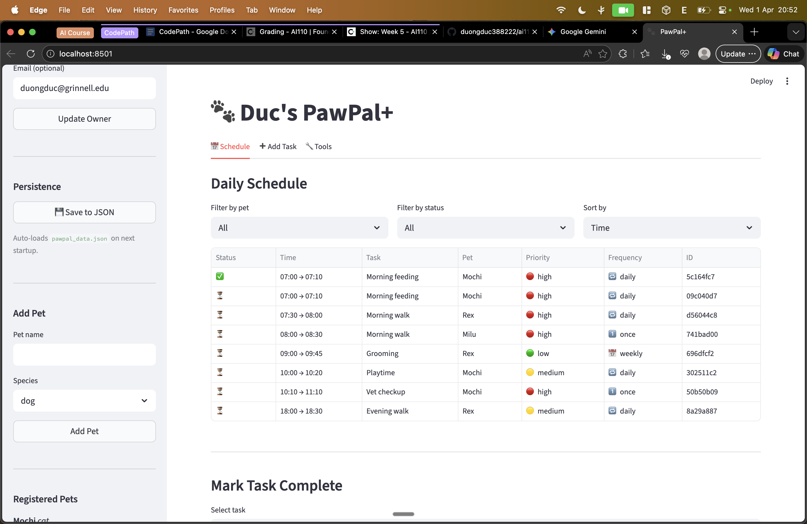
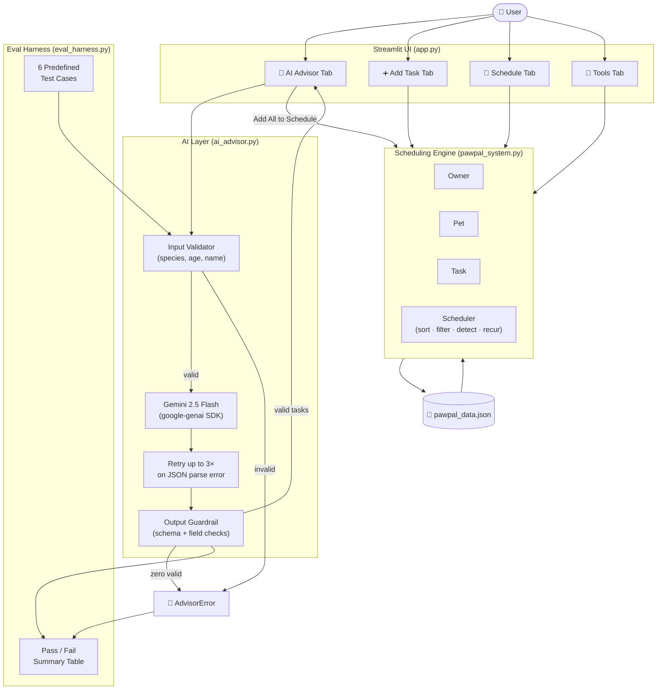
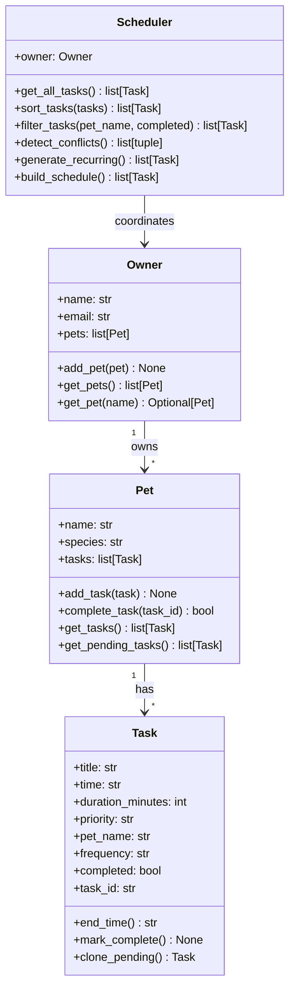

# PawPal+ — Smart Pet Care Scheduler

PawPal+ is a Streamlit-based pet care management system that lets a pet owner schedule, track, and optimise care tasks across multiple pets. It was designed with a UML-first workflow, implemented using Python dataclasses, and verified through a 32-test pytest suite.

---

## Demo



## Walkthrough Video

🎥 [Loom Walkthrough](LOOM_LINK_HERE)

---

## Features

| Feature | Description |
| :--- | :--- |
| **Multi-pet management** | Register any number of pets, each with its own task list |
| **Priority tracking** | Tasks ranked `low` / `medium` / `high` with visual indicators |
| **Chronological sorting** | Full-day view ordered by start time across all pets |
| **Flexible filtering** | Isolate tasks by pet name and/or completion status |
| **Recurrence** | `daily` and `weekly` tasks auto-regenerate once completed |
| **Conflict detection** | Flags overlapping time windows for the same pet |
| **AI Care Advisor** | Gemini 2.5 Flash suggests species-appropriate care tasks from pet name, age, and notes |

---

## System Architecture



> Full source: [`assets/system_architecture.md`](assets/system_architecture.md)

Data flow: user input → AI Advisor tab (input validation → Gemini API with retry → output guardrail) → PawPal scheduling engine → schedule view. The eval harness runs the same AI layer against predefined test cases offline.

### Class diagram (base system)



**Design summary:** `Owner` is the top-level container; `Pet` manages its own task list; `Task` is an atomic unit carrying time, duration, and recurrence metadata; `Scheduler` holds a reference to `Owner` so it can traverse all pets and perform cross-pet operations.

---

## Getting Started

### Prerequisites

Python 3.10 or newer and a free [Google AI Studio API key](https://aistudio.google.com/apikey) for the AI Advisor feature.

### Setup

```bash
python -m venv .venv
source .venv/bin/activate   # Windows: .venv\Scripts\activate
pip install -r requirements.txt
```

Create a `.env` file in the project root with your Gemini key:

```
GEMINI_API_KEY=your-key-here
```

### Run the Streamlit app

```bash
streamlit run app.py
```

Open the URL printed in the terminal (typically http://localhost:8501). Navigate to the **🤖 AI Advisor** tab to use the Gemini-powered task suggester.

### Run the AI evaluation harness

```bash
python eval_harness.py
```

Runs 6 predefined test cases (4 valid-input, 2 guardrail) and prints a pass/fail table. Exit code `0` = all pass.

### Run the CLI demo

```bash
python main.py
```

The demo creates 1 owner (Jordan), 2 pets (Mochi the cat and Rex the dog), 6 tasks, and exercises every scheduler feature: sorted schedule, pet-level filter, conflict detection, task completion, and recurring task generation.

### Run tests

```bash
pytest test_pawpal.py -v
```

---

## Testing

`test_pawpal.py` contains 32 tests organised into six classes:

| Class | What is tested |
| :--- | :--- |
| `TestTask` | `end_time()` arithmetic (including hour-boundary and midnight), `mark_complete()`, `clone_pending()` field inheritance, unique task IDs |
| `TestPet` | `add_task()`, `complete_task()` (found / not found), `get_pending_tasks()` exclusion of completed items |
| `TestOwner` | `add_pet()` / `get_pets()`, `get_pet()` case-insensitive lookup and not-found sentinel |
| `TestSchedulerSort` | Two-task cross-pet ordering, N-task deterministic sort, external list input |
| `TestSchedulerFilter` | Filter by pet name, by pending status, by completed status, combined filter |
| `TestSchedulerConflicts` | Overlap detection, sequential non-conflict, exactly-adjacent non-conflict, cross-pet non-conflict, completed-task exclusion |
| `TestSchedulerRecurrence` | Daily and weekly regeneration, `once` guard, no-duplicate-on-second-call, multi-pet bulk regeneration |

All 32 tests pass with `pytest test_pawpal.py -v`.

---

## Advanced Challenges

Five optional challenges from `challenge.md` were implemented:

### Challenge 1 — Agent-Driven Algorithm: Next Available Slot

`Scheduler.find_next_slot(duration, after, pet_name)` scans all pending tasks in chronological order and walks a cursor forward past occupied windows until a gap of at least `duration` minutes is found. It can search globally (across all pets, for owner time-blocking) or per-pet (to avoid double-booking a single animal). The logic was designed with AI assistance: the key algorithmic insight was to advance the cursor to `max(cursor, task_end)` on each pass rather than re-scanning from the start — this gives O(n) performance.

### Challenge 2 — Data Persistence Layer

`save_to_json(owner, filepath)` and `load_from_json(filepath)` serialise/deserialise the full Owner → Pet → Task object graph using `dataclasses.asdict()` and standard `json`. No third-party serialisation library is needed. In `app.py`, `st.session_state` auto-loads from `pawpal_data.json` on startup if the file exists, and a **Save to JSON** button in the sidebar lets the user persist their session at any time.

### Challenge 3 — Priority-Based Scheduling

`Scheduler.sort_by_priority_then_time()` performs a two-key sort: primary by priority tier (high → medium → low) and secondary by `HH:MM` start time within each tier. The Schedule tab in the Streamlit UI exposes a **Sort by** dropdown (`Time` vs `Priority then Time`) so the user can toggle between views.

### Challenge 4 — Professional UI & Formatting

`main.py` uses the `tabulate` library (`rounded_outline` style) to render every schedule output as a formatted table with emoji priority indicators (🔴/🟡/🟢). The Streamlit UI already uses these same icons alongside frequency glyphs (🔁/📅/1️⃣) in the schedule dataframe.

### Challenge 5 — Multi-Model Benchmarking

See the **Prompt Comparison** section in `reflection.md` for a side-by-side analysis of Claude vs GPT-4o on the `find_next_slot` implementation task.

---

## AI Care Advisor — Sample I/O

The AI Advisor tab accepts a pet name, species, age, and optional notes. It calls Gemini and returns structured care tasks that can be added to the schedule in one click.

### Example 1 — Dog, 2 years old

**Input:** Buddy · dog · 2 years · "outdoor, active"

**Output (suggested tasks):**

| Task | Time | Duration | Priority | Frequency |
| :--- | :--- | :--- | :--- | :--- |
| Morning walk | 07:00 | 45 min | high | daily |
| Breakfast feeding | 08:00 | 15 min | high | daily |
| Afternoon play session | 15:00 | 30 min | medium | daily |
| Evening walk | 18:00 | 30 min | high | daily |
| Dinner feeding | 19:00 | 15 min | high | daily |

---

### Example 2 — Cat, 5 years old

**Input:** Mochi · cat · 5 years · "indoor only"

**Output (suggested tasks):**

| Task | Time | Duration | Priority | Frequency |
| :--- | :--- | :--- | :--- | :--- |
| Morning feeding | 08:00 | 10 min | high | daily |
| Litter box cleaning | 09:00 | 10 min | high | daily |
| Interactive play session | 11:00 | 20 min | medium | daily |
| Evening feeding | 18:00 | 10 min | high | daily |

---

### Example 3 — Invalid species (guardrail triggered)

**Input:** Nemo · dragon · 2 years

**Output (no API call made):**

```
Advisor error: Species 'dragon' is not supported.
Choose from: bird, cat, dog, fish, other, rabbit.
```

---

## Evaluation Harness — Sample Output

```
PawPal+ AI Advisor — Evaluation Harness
============================================================
#       Input                 Result    Detail
------  --------------------  --------  -----------------------------------------------
Case 1  Buddy (dog, 2y)       PASS ✅   4 task(s) returned, all fields valid
Case 2  Mochi (cat, 5y)       PASS ✅   5 task(s) returned, all fields valid
Case 3  Thumper (rabbit, 1y)  PASS ✅   4 task(s) returned, all fields valid
Case 4  Tweety (bird, 3y)     PASS ✅   4 task(s) returned, all fields valid
Case 5  Nemo (dragon, 2y)     PASS ✅   guardrail raised AdvisorError ✓
Case 6  — (dog, -1y)          PASS ✅   guardrail raised AdvisorError ✓
============================================================
Result: 6/6 passed
```

---

## AI Collaboration

This project was built with AI assistance (Cursor / Claude) for:

- Drafting and iterating the UML class diagram (decided `Scheduler` should hold a reference to `Owner` rather than a flat pet list — cleaner access by name)
- Generating dataclass stubs from the UML spec
- Implementing conflict detection overlap logic and recurrence deduplication
- Expanding the pytest suite and catching edge cases (adjacent-but-not-overlapping tasks, cross-pet false positives, double-recurrence guards)

All AI outputs were reviewed against the spec and manually verified before acceptance. The most significant override: AI initially proposed using `datetime` objects for time representation; this was simplified to `str` (`HH:MM`) because the project scope is single-day scheduling and string arithmetic is sufficient, keeping the model lighter.

See `reflection.md` for a full account of design decisions, tradeoffs, and AI collaboration strategy.


