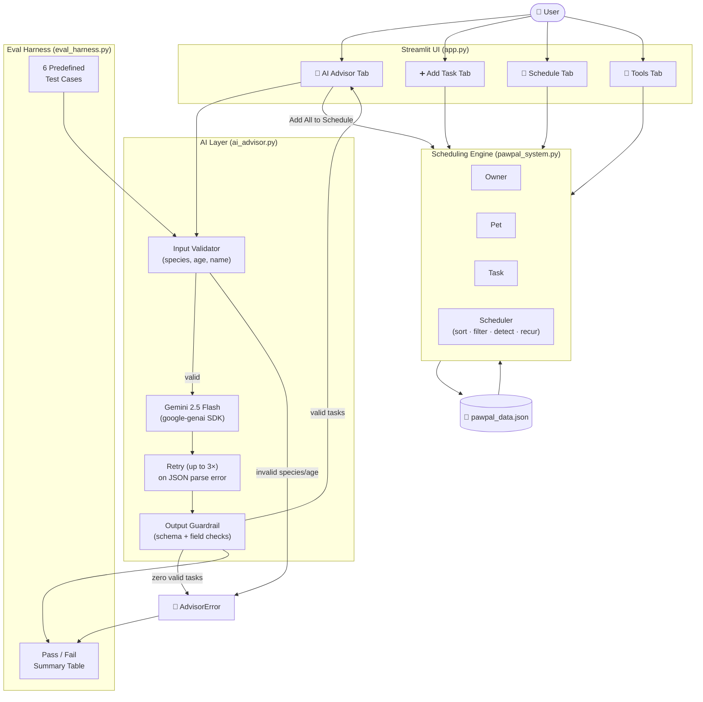

# PawPal+ System Architecture

```mermaid
flowchart TD
    User([👤 User])

    subgraph UI["Streamlit UI (app.py)"]
        TabSchedule["📅 Schedule Tab"]
        TabAdd["➕ Add Task Tab"]
        TabTools["🔧 Tools Tab"]
        TabAI["🤖 AI Advisor Tab"]
    end

    subgraph Advisor["AI Layer (ai_advisor.py)"]
        InputVal["Input Validator\n(species, age, name)"]
        GeminiAPI["Gemini 2.5 Flash\n(google-genai SDK)"]
        OutputGuard["Output Guardrail\n(schema + field checks)"]
        Retry["Retry (up to 3×)\non JSON parse error"]
    end

    subgraph Core["Scheduling Engine (pawpal_system.py)"]
        Owner["Owner"]
        Pet["Pet"]
        Task["Task"]
        Scheduler["Scheduler\n(sort · filter · detect · recur)"]
    end

    subgraph Eval["Eval Harness (eval_harness.py)"]
        TestCases["6 Predefined\nTest Cases"]
        Summary["Pass / Fail\nSummary Table"]
    end

    Persist[("💾 pawpal_data.json")]

    User --> TabAI
    User --> TabAdd
    User --> TabSchedule
    User --> TabTools

    TabAI --> InputVal
    InputVal -- valid --> GeminiAPI
    InputVal -- invalid species/age --> AdvisorError["🚫 AdvisorError"]
    GeminiAPI --> Retry
    Retry --> OutputGuard
    OutputGuard -- valid tasks --> TabAI
    OutputGuard -- zero valid tasks --> AdvisorError

    TabAI -- "Add All to Schedule" --> Core
    TabAdd --> Core
    TabTools --> Core
    TabSchedule --> Core

    Core --> Persist
    Persist --> Core

    TestCases --> InputVal
    OutputGuard --> Summary
    AdvisorError --> Summary
```
